# SecuriNets ISI CTF Writeups


These are write-ups for some OSINT challenges from SecuriNets ISI CTF competitions I had the privilege of being its author. I hope that participants had fun solving the tasks and got some added value. Happy reading!
>Note: The challenges are imaginative, they have no connection to reality and are written for educational purposes to introduce some OSINT skills.


## Olympic

### Description 

>The Paris 2024 Olympics are finally here; everyone is excited about this ultimate event! 
Mariano, a Spanish Olympic athlete, is debuting in Paris this year. He flew from his hometown, Madrid, to Paris on 07/20/2024 to participate in this iconic event. Thrilled to visit the City of Lights for the first time and participate in the Olympic Games, Mariano faced a major problem he lost his suitcase at ORLY airport. The suitcase contained his essential equipment for the competition. Your mission is to work with the airport staff to help Mariano find his suitcase quickly so he can compete in the games on time.

>FLAG FORMAT Securinets{Latitude/Longitude}

>Note: Put values with 3 digits after the decimal point.

>AUTHOR: S4LM4

>This image was attached to the task :

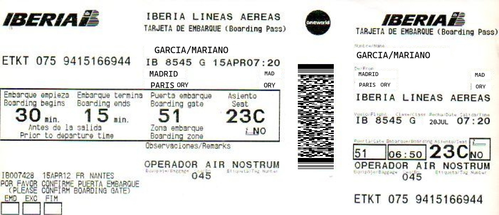

### Solution
Examining the provided image, it shows a boarding pass with a barcode that needs to be analysed.To do this, we went to [**OSINT Framework**](https://osintframework.com) to find an online barcode decoder as detailed in the following screenshots :

 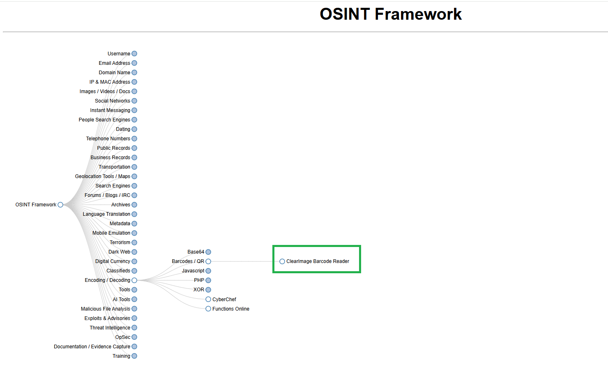

 

 The barcode redirected us to Google Drive image, as shown in the given image :


The information in the image seemed to be typed in Spanish, so we needed to translate it to English for better understanding.

```
Very sensitive personal information
Name: Mariano.
Name: García García.
Date of birth: 09/25/1997.
Age: 27 years.
Nationality: Spanish.
Occupation: Athlete.
Family: He has two married sisters, his father is a doctor and his mother is a professor.
Travel luggage: Two black suitcases, one of which contains a cell phone with CID: 28868 MCC: 208
MNC: 10 LAC / TAC: 49217
```
Reading this information, we understood that the luggage consisted of two suitcases, one of which contained a cell phone with CID: 28868 MCC: 208
MNC: 10 LAC / TAC: 49217. These pieces of information (MCC, MNC, LAC/TAC, and CID) are directly related to a cell phone’s network connection, that can lead us to the exact location of the missing suitcase.
Using [OpenCellID](https://opencellid.org), the world's largest Open Database of Cell Towers, we finally identified the exact location of the suitcase as detailed in the following screenshot :

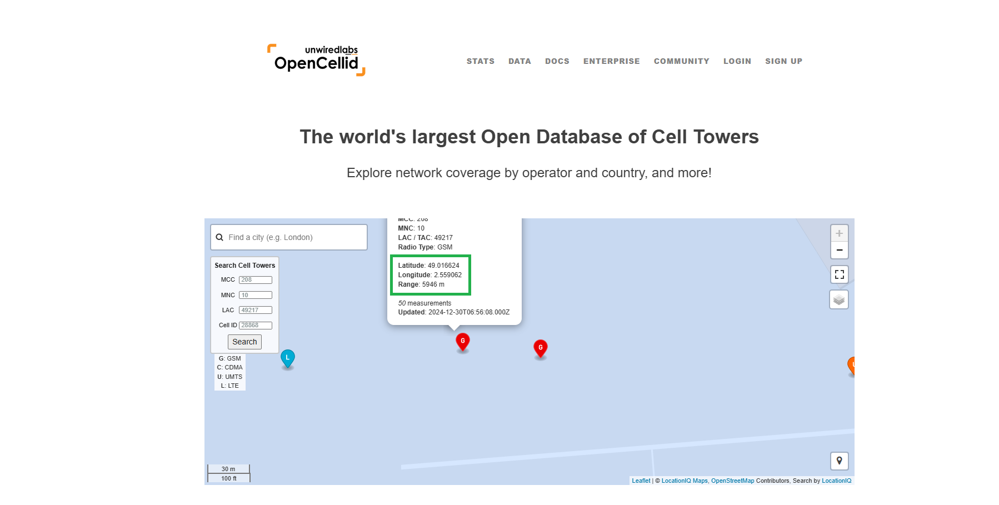

and finally, we got the flag! 

Securinets{49.016/2.559}

## Tr0jan

### Description 
>Could you help me find the name of the studio founder who designed and created this artwork ?

>Flag format Securinets{name_familyname}

>Note: the flag should be submitted in lowercase format.

>AUTHOR: S4LM4

>This image was attached to the task :


The first reflex in this type of challenge is to reverse this image using a reverse image engine like [**Google image search**](https://images.google.com), for example.


When we looked at the article, we found out that the attached image is the image of Zeus' horse designed by Atelier Blam
Going to Atelier Blam's official website, we discovered that mr Aurelien Meyer is the founder of the studio, and we got the flag!


and finally, we got the flag! 

Securinets{aurelien_meyer}

## 0RB1t 1

### Description 
>While you were working as a security engineer in national law enforcement, an orbital device was launched to observe specific locations on the continent. Unfortunately, your chief reported that the device is not functioning as expected the images it captures are unclear. He suspects the device may have been hacked. Given the attached image, Your mission is to investigate the cause of the malfunction. As a first step, you need to retrieve the device's ID assigned by the operator.

>FLAG FORMAT: Securinets{FLAG}

>AUTHOR: S4LM4

>This image was attached to the task :

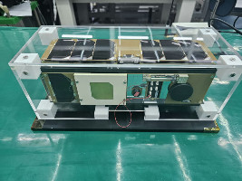

### Solution
We used [**Google image search**](https://images.google.com) to reverse the attached image, and we got the name of the satellite, which was Kafasat. The result is detailed in the screenshot below :


Having the name of the satellite we need now, an open source satellite database, we did some research and we found [**satnogs**](https://satnogs.org), a free software and open source hardware platform aimed to create a satellite ground station network.
Searching satnogs, we found the satellite ID that we are looking for, as detailed in the screenshot below :


and finally, we got the flag! 

Securinets{APQS-1800-5981-4551-3856}

## 0RB1t 2

### Description 
> During your investigation, you obtained the latest satellite signals. You converted these signals into a specific format that made them more understandable, bringing you closer to identifying the hacker’s location. Can you determine the city where the attacker is?

> FLAG FORMAT: Securinets{CITY}

> Note: the flag should be submitted in uppercase format.

>AUTHOR: S4LM4

#### This audio was attached to the task :

<audio controls>
  <source src="Attachments\0RB1t 2.wav" type="audio/wav">
  <p>The content of the file is not supported in this browser.</p>
</audio>

### Solution
Examining the audio provided. It seemed to be Morse code encoded that needs to be decoded.
we looked for an online Morse code audio decoder and used [morsecode.world](https://morsecode.world), which gave the following message as detailed in the screenshot below :


Considering the message that we got, we visited the hacker’s X profile. While going through the account, we discovered an interesting post which was his personal CV which revealed the hacker’s identity and redirected us to Martin’s LinkedIn profile.


Analyzing the LinkedIn profile, particularly the contact info section, we got Martin's personal email.


Having the email address of Martin allowed us to uncover additional information about the hacker using [**Epieos**](https://epieos.com), an OSINT search engine that allows you to perform an email or phone reverse lookup. Epieos provided a Google Maps link, with the result shown in the screenshot below:


Following that link, we finally got the location of the hacker and obtained the flag!

Securinets{AMSTERDAM}

## T4Y4R4

### Description 
> Being part of the technical team of an aerospace corporation, one of the clients reported that an airplane was making unusual sounds, particularly during flight N397DA. To identify the root cause, it was necessary to determine the exact delivery date of the aircraft to review its precise mechanical components. 

>FLAG FORMAT: Securinets{YYYY-MM-DD}

>AUTHOR : S4LM4

### Solution
The task gave us the flight number, but we need to determine the plane type to discover its delivery date. A popular resource that crossed the mind was [Flightradar24](https://www.flightradar24.com), a live flight tracker that shows air traffic in real time. Consulting Flightradar24 revealed the aircraft type as Boeing 737-832, as detailed in the given screenshot :

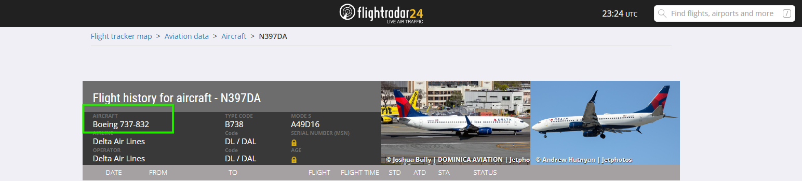

Having this valuable information, we can now determine the exact delivery date by consulting [JetPhotos](https://www.jetphotos.com) as shown in the image below:


Now we've got the flag! 

Securinets{2000-08-24}

## I 4M TH3 C4PT4IN N0W 

### Description 
>One Friday night, while monitoring the position of an Oil tanker that carried crude oil from Saudi Arabia to Senegal, you noticed a suspicious deviation from its usual itinerary. To learn more about this anomaly, you tried to contact the captain responsible for the ship's lead, but in vain. A few minutes later, the phone rang; fortunately, you managed to record the strange call.
Attached to the task are a few files that you collected as evidence for your investigation.

>Flag format Securinets{FLAG}

>Note : Only 2 attempts for this task are allowed.

>Author: S4LM4
#### The following files were attached to the challenge in a ZIP file.

#### File 1 = audio File :
<audio controls>
  <source src="Attachments\Call.wav" type="audio/wav">
  <p>The content of the file is not supported in this browser.</p>
</audio>

#### File 2 = TXT File:
<object data="Attachments\L0C4TI0N.txt" type="text/plain" width="600" height="400">
<p>The content of the file is not supported in this browser.</p>
</object>

### Solution
In this challenge, we received a ZIP file that needed to be extracted. After extracting it, we found two files: the first was an audio file named call, and the second was a TXT file named L0C4TI0N, which we assumed to represent the last known location of the ship before the call.
First, when we played the audio file, it sounded like a person speaking, but the language was unfamiliar. To transcribe the audio, we first needed to identify the spoken language. Given the L0C4TI0N file, we suspected it might provide a clue. Opening the file, we found the following random string: 
```
knktwgxu
```
Since we knew the file contained a location, we searched for a tool that could decode location-based strings. When we Googled the phrase "latitude and longitude into a short string of letters," we found a result suggesting that it might be a geohashed location.  

To verify this, we used the [Movable Type geohashing](https://www.movable-type.co.uk/scripts/geohash.html) tool, which can encode latitude and longitude into a string or decode a string back into coordinates. After decoding the string, we obtained an exact location as shown in the following image:


The result placed the ship near Angola and the Republic of Congo, meaning the language spoken in the audio was either French or Portuguese, as these two countries’ official languages are French and Portuguese. Since it did not sound like French, we proceeded with the assumption that it was Portuguese.  

After transcribing the audio into text using [Turbo Transcriptor](https://turboscribe.ai), we obtained the following text:


Next, we copied the transcribed text and translated it into English, giving the following result:

```
The ship is under control. No one can move here, and the entire crew is now detained. Thanks to our genius, the pirate captain named Mamadou76589, the mission was a success. If you want the crew to survive, you will have to pay a ransom.
```

From this translation, we learned that the pirate captain’s name was `Mamadou76589`. This nickname appeared to be a username.  

We used DCrawl, a powerful OSINT tool for username search across platforms. The results revealed an Instagram account, as shown in the screenshot below:


While investigating the Instagram profile, we examined the highlights, which caught our attention:

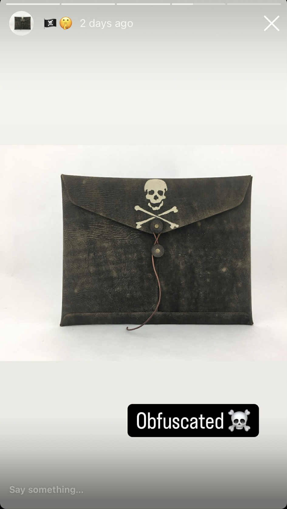

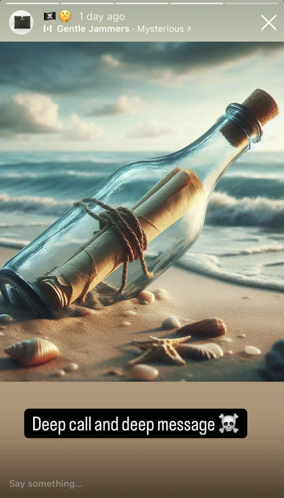

While analyzing the text in the Instagram stories, we hypothesized that a file might be embedded within the call audio file. Since steghide is a Linux tool that can extract hidden files from WAV audio files, we attempted extraction

However, the extraction required a passphrase.  

Returning to the Instagram account for further investigation, we discovered a Threads profile linked in the bio. 

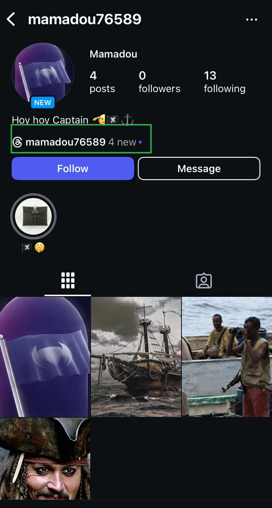

While examining the Threads profile, we found a post containing a promotional code, as shown in the following image:


Using this code as the passphrase for steghide, we successfully extracted a new TXT file named `FLAG101` that had been embedded into the audio file.

 

When we opened the file, we found the flag, but it was missing the last character, as shown in the screenshot below:


The hint suggested that the missing character corresponded to the number of times Mamadou had changed his Instagram username.  

A quick Google search led us to an article explaining how to determine the number of times a user has changed their Instagram username by consulting the About this account section on Instagram, as detailed more in the given Screenshot :

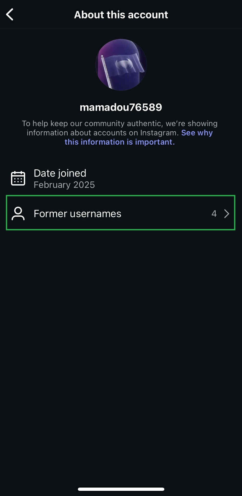

Using this information, we determined the final character was `4` and finally obtained the complete flag!

Securinets{Os1nT_3Xp3RT4}


## Chi é

### Description 
> Can you give me the Registry expiry date of baobab experience?

>FLAG FORMAT: Securinets{YYYY-MM-DD}

>AUTHOR: S4LM4

### Solution
By conducting research on Google about « What does registry expiry date mean? » You will find out that Registration Expiry Date refers to the final day of the registration term of a Domain Name.

So , we need to look for the website of Baobab Experience. But, how can we find its registry expiry date?

Through our research on Google, we learned about a Linux command-line called “whois” that can provide valuable information about websites.

Running that command-line on our terminal, we got this information.

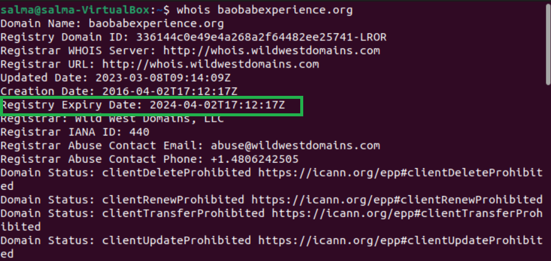

## Agent 

### Description 
>While working as a private detective, your mission is to investigate an unauthorized intrusion that leaked confidential documents. During your investigation, you determined the location of the hackers gang. You and your team decided to raid them, but unfortunately, you failed to catch them as you arrived a bit late and they managed to escape. 

>But while analyzing the criminals' space and performing digital analysis, you found this photo that seemed suspicious and decided to investigate it further.

>FLAG FORMAT Securinets{FLAG}

>AUTHOR : S4LM4

>This image was attached to the task :


### Solution
Examining the provided image, we noticed the meta logo. the first hint that came to mind was to analyze the image metadata using ExifTool, which we ran on the Linux terminal. This provided us with valuable information, including a link to a pastebin post, as detailed more on the given screenshot :

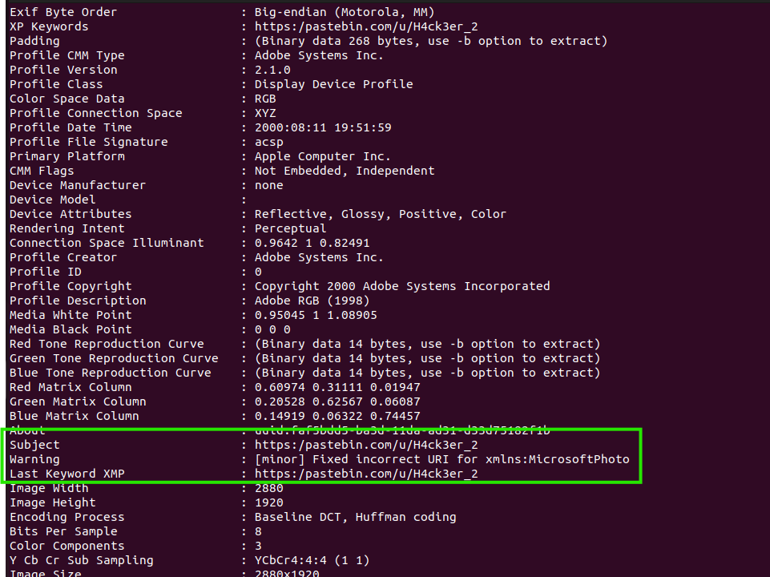

Following the pastebin link, it redirected us to H4ck3er_2, where a suspicious message was posted, as shown in the screenshot below:


Reading the message, we understood that something had been posted, but it was now deleted. So, we need to bring it back. [Wayback Machine](https://web.archive.org/) an online internet archive that allows users to go "back in time" to see how websites looked in the past. The following screenshots show  captures of the hacker account posts from the past:


The image above shows the content in a file named Flag, which contained an unreadable string. We concluded that it needed to be decoded using a popular online decoder, [dcode.fr](https://www.dcode.fr).


Now we've got the flag! 

Securinets{Y0u_ar3_g00d_in_m3t4d4t4}


